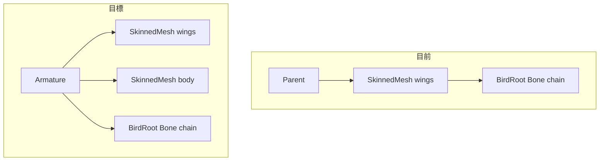

# Armature 同層結構 + 多 Mesh 共用骨骼

## 目標結構



與 [ButterFly01.glb](c:/Users/jay/Downloads/ButterFly01.glb) 匯入後的階層一致，便於日後多 Mesh 共用同一動畫 clip。

---

## 核心技術決策

### 1. Armature 解析策略（新模組）

新增 [`src/lib/wing-rigging/resolveArmatureContainer.ts`](src/lib/wing-rigging/resolveArmatureContainer.ts)：

- `isArmatureContainer(node)`：名稱符合 `/armature/i`，或已有 `Bone` 子節點（相容既有 GLB）
- `resolveArmatureContainer(targetMesh, modelRoot)`：
  1. 若 `targetMesh.parent` 已是 Armature → 直接沿用
  2. 否則在 parent 或 `modelRoot` 下尋找名為 `Armature` 的節點
  3. 仍無則建立 `THREE.Group`（name: `Armature`），插入於 `targetMesh` 與其 parent 之間（reparent mesh 到 Armature 下）

### 2. 骨骼不再掛在 SkinnedMesh 下

修改 [`src/lib/wing-rigging/convertToSkinnedMesh.ts`](src/lib/wing-rigging/convertToSkinnedMesh.ts)：

- 移除 `skinned.add(rootBone)` 與 `rootBone` 參數
- 將 `bind(skeleton)` **延後**至 SkinnedMesh 已 `armature.add(skinned)` 之後執行（修正現有 bind 在離樹狀態執行的潛在矩陣問題）
- 新增 `bindSkinnedMesh(skinned, skeleton)` 供外部在場景掛載後呼叫

### 3. 拆分 Rig 建立 vs Mesh 蒙皮

重構 [`src/lib/wing-rigging/applyWingRig.ts`](src/lib/wing-rigging/applyWingRig.ts)：

| 函式                                                                        | 職責                                                                                |
| --------------------------------------------------------------------------- | ----------------------------------------------------------------------------------- |
| `createWingSkeleton(landmarks, armature)`                                   | 建立 `rootBone` + `Skeleton`，`armature.add(rootBone)`                              |
| `bindMeshToWingSkeleton(mesh, armature, skeleton, localLandmarks, options)` | bake geometry 至 armature 空間、計算權重、建立 SkinnedMesh、掛入 armature 後 `bind` |
| `applyWingRigToMesh(...)`                                                   | 首次：resolve armature → create skeleton → bind 第一個 mesh                         |

`localLandmarks` 與 `boneIndexByName` 在首次建立後固定，後續 mesh 沿用同一組 landmarks 做權重計算（`computeWingSkinWeights` 已支援 body 區域鎖定 BirdRoot）。

### 4. 多 Mesh 共用 Skeleton

Three.js 允許多個 `SkinnedMesh` 引用同一 `THREE.Skeleton` 實例。前提：

- 所有 mesh geometry 皆 bake 至 **同一 Armature 本地空間**
- 各 SkinnedMesh 在 Armature 下維持 identity transform
- 共用同一組 `boneInverses`（bind pose 一致）

第二個 mesh（如 `body`）流程：不重建骨骼，只呼叫 `bindMeshToWingSkeleton`。

---

## 狀態管理變更（[`useGlbViewer.ts`](src/composables/useGlbViewer.ts)）

將單一 mesh 狀態擴展為 Rig 會話狀態：

```typescript
// 取代單一 wingRiggedMesh
let wingArmature: THREE.Object3D | null = null;
let wingRootBone: THREE.Bone | null = null;
let wingSkeleton: THREE.Skeleton | null = null;
let wingRiggedMeshes = new Map<string, THREE.SkinnedMesh>(); // objectUuid -> mesh
let wingArmatureOwned = false; // 是否由本工具新建（清理時可選擇還原）
```

**`applyWingRig()` 分支邏輯：**

- `!wingRigReady`：6 點標記完成 → 建立 Armature + Skeleton → 綁定目標 mesh → `wingRigReady = true`
- `wingRigReady`：對 `rigTargetNodeId` 選中的 **未綁定** `Mesh` → 僅 `bindMeshToWingSkeleton`（若已綁定則提示）

**輔助函式調整：**

- `updateWingSkeletonPreview()`：改用 `resolveArmatureContainer`，骨骼掛 Armature（與正式 Rig 一致）
- `clearWingRigRuntimeState()`：dispose 所有 rigged mesh 的 heatmap、移除 `rootBone`、清空 map
- `recomputeWingSkinWeights()` / `toggleWingWeightHeatmap()`：依 `rigTargetNodeId` 解析對應的 `SkinnedMesh`（權重微調針對「目前選中的已綁定 mesh」）
- `SkeletonHelper`：改為 `new THREE.SkeletonHelper(wingRootBone)`（骨骼不在 SkinnedMesh 子樹時，`SkeletonHelper(skinned)` 無法取得骨骼）

---

## UI 變更（[`WingRiggingPanel.vue`](src/components/WingRiggingPanel.vue)）

在 `rigReady` 後新增「附加 Mesh 蒙皮」區塊：

- 下拉選單：僅列出 **尚未綁定** 的普通 `Mesh`（排除已在 `wingRiggedMeshes` 的節點）
- 按鈕：「套用蒙皮到此 Mesh」（或首次按鈕文案維持「建立骨骼與權重」，rig 就緒後改為「套用蒙皮」）
- 顯示已綁定 mesh 清單（如 `wings`、`body`）

[`useGlbViewer.ts`](src/composables/useGlbViewer.ts) 新增 computed：

- `wingUnboundMeshOptions`：可附加蒙皮的 mesh 候選
- `wingBoundMeshLabels`：已綁定 mesh 名稱列表

---

## 目標場景樹範例（Butterfly）

套用 Rig 到 `wings` 後再蒙皮 `body`：

```
Scene
└── Armature
    ├── SkinnedMesh: wings
    ├── SkinnedMesh: body
    └── Bone: BirdRoot
        ├── L_Wing_01_Shoulder → ...
        └── R_Wing_01_Shoulder → ...
```

若 GLB 已有 `Armature`（如 Butterfly），直接沿用，不另建容器。

---

## 實作順序

1. **`resolveArmatureContainer.ts`** + 單元邏輯（純函式，易手動驗證）
2. **`convertToSkinnedMesh.ts`**：移除 bone 子節點、延後 bind
3. **`applyWingRig.ts`**：拆分 create / bind API
4. **`useGlbViewer.ts`**：狀態重構、apply/preview/cleanup/SkeletonHelper 更新
5. **`WingRiggingPanel.vue`** + `App.vue` / `ModelInspector.vue` props 串接
6. **手動驗證**（見下）

---

## 驗證計畫

| 案例                                             | 預期                                                                  |
| ------------------------------------------------ | --------------------------------------------------------------------- |
| 載入 Butterfly01.glb → Rig `wings` → 蒙皮 `body` | Inspector 顯示 Armature 下 wings/body/Bone 同層；拍翅動畫兩者同步變形 |
| 載入單一 mesh 模型（無 Armature）                | 自動建立 `Armature` 群組；rig 後階層正確                              |
| 6 點預覽骨架                                     | 骨骼出現在 Armature 下，非 Mesh 子節點                                |
| 權重熱圖 / 重新計算權重                          | 切換目標 mesh 後分別作用於對應 SkinnedMesh                            |
| 重新載入模型                                     | 狀態完全清除，無殘留 helper / heatmap                                 |

---

## 風險與注意

- **bind 時機**：必須在 `armature.add(skinned)` 且 `updateMatrixWorld(true)` 後再 `bind`，否則 inverse bind matrix 錯誤
- **既有 GLB 骨骼**：若 Armature 下已有 Blender 骨骼，本工具建立的新 `BirdRoot` 會與之並存；MVP 不自動合併既有 skeleton（`analyzeBirdModel` 警告已存在）
- **匯出 GLB**：本次不涵蓋；階層調整後匯出邏輯若日後加入，可直接對齊 glTF skin.joints 慣例
