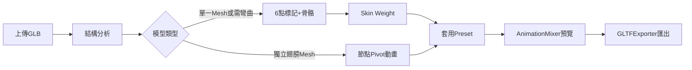
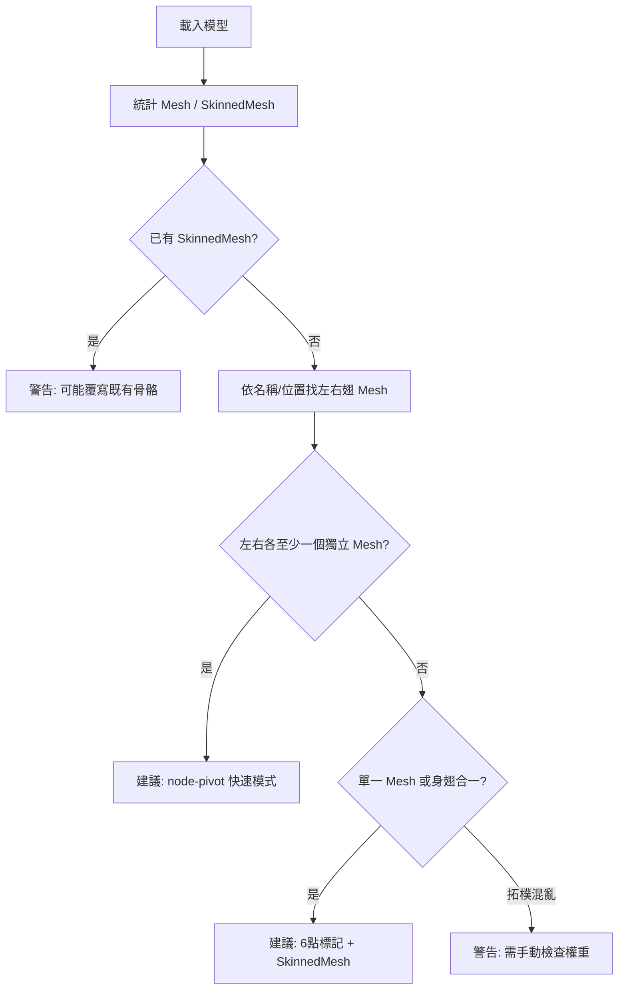

# 鳥類翅膀 Rigging 網站工具 — 技術方案

## 1. 概念說明

目標是在瀏覽器端，把**無骨骼、無動畫**的鳥類 GLB，透過使用者標記 6 個翅膀關鍵點，半自動建立骨骼階層、計算 skin weight、套用可調參數的拍翅 preset，最後匯出含動畫的新 GLB。

核心技術路徑：



與現有專案的整合點：

- 載入/場景樹/匯出：沿用 [`src/composables/useGlbViewer.ts`](src/composables/useGlbViewer.ts)、[`src/lib/exportGlb.ts`](src/lib/exportGlb.ts)
- Pivot 插入模式：參考 [`src/lib/addRotorAnimation.ts`](src/lib/addRotorAnimation.ts) 的 `createPivotForTarget()`、`QuaternionKeyframeTrack` 模式
- 動畫 UI：擴充 [`src/components/ModelInspector.vue`](src/components/ModelInspector.vue)，新增 `WingRiggingPanel.vue`
- 類型：擴充 [`src/types/glb-viewer.ts`](src/types/glb-viewer.ts)，`AnimationClipSettings.source` 加 `'wing' | 'wing-rig'`

---

## 2. 整體架構與模組拆分

建議新增 `src/lib/wing-rigging/` 目錄：

| 模組        | 檔案                                     | 職責                                     |
| ----------- | ---------------------------------------- | ---------------------------------------- |
| GLB 載入    | 既有 `useGlbViewer`                      | 載入、場景樹、相機 fit                   |
| 模型分析    | `analyzeBirdModel.ts`                    | 判斷 mesh 結構、左右翅候選、拓樸風險     |
| 點選標記    | `useWingLandmarks.ts` + Viewport raycast | 6 點世界座標、可拖曳微調                 |
| 骨骼建立    | `buildBirdSkeleton.ts`                   | 6 點 → Bone 階層（local transform 正確） |
| Mesh 轉換   | `convertToSkinnedMesh.ts`                | Mesh → SkinnedMesh + Skeleton            |
| Skin Weight | `computeWingSkinWeights.ts`              | 頂點權重演算法                           |
| Preset      | `wingFlapPresets.ts` + `presetToClip.ts` | JSON preset → AnimationClip              |
| 預覽        | 既有 mixer + `useGlbViewer` render loop  | 播放/暫停/速度/loop                      |
| 匯出        | 既有 `exportGlb.ts`                      | SkinnedMesh + Skeleton + animations      |

### 資料流

```text
UserUpload (File)
  → GLTFLoader → modelRoot: Object3D
  → analyzeBirdModel(modelRoot) → BirdModelAnalysis
  → user marks 6 × Vector3 (world) → WingLandmarks
  → buildBirdSkeleton(landmarks, modelRoot) → { rootBone, skeleton, boneByName }
  → convertMeshesToSkinned(targetMeshes, skeleton, boneByName)
  → computeWingSkinWeights(geometry, landmarks, boneIndices)
  → applyWingPreset(preset, options) → AnimationClip
  → mixer.clipAction(clip).play()
  → exportObjectAsGlb({ root, animations: [clip] })
```

### 重要資料結構（TypeScript）

```typescript
// src/types/wing-rigging.ts

export type WingLandmarkId =
  | "L_Shoulder"
  | "L_Mid"
  | "L_Tip"
  | "R_Shoulder"
  | "R_Mid"
  | "R_Tip";

export type WingLandmarks = Record<WingLandmarkId, THREE.Vector3>; // world space

export type BirdBoneName =
  | "BirdRoot"
  | "L_Wing_01_Shoulder"
  | "L_Wing_02_Mid"
  | "L_Wing_03_Tip"
  | "R_Wing_01_Shoulder"
  | "R_Wing_02_Mid"
  | "R_Wing_03_Tip";

export interface BirdModelAnalysis {
  meshCount: number;
  hasSkinnedMesh: boolean;
  hasExistingSkeleton: boolean;
  leftWingMeshCandidates: string[]; // nodeId
  rightWingMeshCandidates: string[];
  bodyMeshCandidates: string[];
  suggestedMode: "node-pivot" | "full-rig" | "manual";
  warnings: string[];
}

export interface WingFlapPreset {
  name: string;
  duration: number;
  loop: boolean;
  mirrorRight: boolean;
  tracks: WingFlapTrack[];
}

export interface WingFlapTrack {
  bone: Exclude<BirdBoneName, "BirdRoot">;
  space: "local";
  rotationType: "euler" | "quaternion";
  axis: "x" | "y" | "z";
  keys: Array<{ time: number; value: number }>; // radians
  mirrorSign?: number; // 右翅鏡射時角度乘數，預設 -1
}

export interface WingAnimationOptions {
  speedMultiplier: number; // 影響 duration = base / speed
  amplitudeMultiplier: number; // 角度 × amplitude
  mirrorRight: boolean;
  loopMode: "repeat" | "once" | "pingpong";
}
```

---

## 3. GLB 結構判斷邏輯

### 判斷流程



### 實務建議

**Q1: 左右翅膀是獨立 Mesh，能否直接做節點動畫？**

可以，且這是 **MVP 第一階段最快路徑**。在翼根插入 pivot（沿用 `createPivotForTarget`），對 pivot 做 `QuaternionKeyframeTrack`，整片翅膀剛體旋轉。優點：無需 skin weight；缺點：翅膀不會沿骨段彎曲。

**Q2: 獨立 Mesh 但想要彎曲，是否仍要 SkinnedMesh？**

要。剛體節點動畫無法讓單一 mesh 內不同區域有不同變形。若翅膀 mesh 夠薄、只需整片略彎，可只用 1 根骨（肩）做節點動畫；若要肩→中段→翅尖漸進彎曲，必須 SkinnedMesh + 多骨權重。

**Q3: 整隻鳥單一 Mesh 如何轉 SkinnedMesh？**

1. 使用者標記 6 點
2. 建立骨骼階層
3. clone geometry，**bake mesh world matrix 到頂點**（或把 mesh transform 歸一後再算權重）
4. 加 `skinIndex` / `skinWeight` attribute
5. `new SkinnedMesh(geometry, material)`，`skinnedMesh.add(rootBone)`，`bind(skeleton)`
6. 替換場景中原 mesh

**Q4: 拓樸很亂如何提示？**

在 `analyzeBirdModel` 檢查並產生 `warnings`：

- 翅膀未展開（bounding box 厚度/展寬比異常）
- 左右翅 mesh 名稱無法辨識（`left/right/wing` 等關鍵字）
- 單 mesh 三角面數過高（>50k 權重計算慢）
- mesh 有非均勻 scale 或旋轉（需 bake）
- 身體與翅膀 vertex 在肩點附近距離過近（易撕裂）

UI 以黃色警告條列出，並建議：「請確認模型 T-pose / 翅膀展開」「建議先分離左右翅 mesh」。

---

## 4. 骨骼建立（local/world 正確處理）

Bone 的 `position` 是相對父骨的 local 座標。做法：先在世界空間定好關節位置，再逐層換算 local。

```typescript
// src/lib/wing-rigging/buildBirdSkeleton.ts
import * as THREE from "three";
import type { WingLandmarks, BirdBoneName } from "../../types/wing-rigging";

const BONE_NAMES = {
  root: "BirdRoot",
  L: ["L_Wing_01_Shoulder", "L_Wing_02_Mid", "L_Wing_03_Tip"],
  R: ["R_Wing_01_Shoulder", "R_Wing_02_Mid", "R_Wing_03_Tip"],
} as const;

export function buildBirdSkeleton(
  landmarks: WingLandmarks,
  attachParent: THREE.Object3D, // 通常為 model root
) {
  // BirdRoot 放在兩肩中點
  const rootWorld = new THREE.Vector3()
    .addVectors(landmarks.L_Shoulder, landmarks.R_Shoulder)
    .multiplyScalar(0.5);

  const rootBone = new THREE.Bone();
  rootBone.name = BONE_NAMES.root;

  function createChain(
    parent: THREE.Bone,
    parentWorld: THREE.Vector3,
    worldPoints: THREE.Vector3[],
    names: string[],
  ) {
    let currentParent = parent;
    let currentWorld = parentWorld.clone();

    for (let i = 0; i < names.length; i++) {
      const bone = new THREE.Bone();
      bone.name = names[i];

      const targetWorld = worldPoints[i];
      const localPos = targetWorld.clone().sub(currentWorld);
      bone.position.copy(localPos);

      currentParent.add(bone);
      currentParent = bone;
      currentWorld = targetWorld.clone();
    }
  }

  createChain(
    rootBone,
    rootWorld,
    [landmarks.L_Shoulder, landmarks.L_Mid, landmarks.L_Tip],
    [...BONE_NAMES.L],
  );
  createChain(
    rootBone,
    rootWorld,
    [landmarks.R_Shoulder, landmarks.R_Mid, landmarks.R_Tip],
    [...BONE_NAMES.R],
  );

  // 把 rootBone 掛到 attachParent，並設定 root 的 local position
  attachParent.updateMatrixWorld(true);
  const parentInv = attachParent.matrixWorld.clone().invert();
  const rootLocal = rootWorld.clone().applyMatrix4(parentInv);
  rootBone.position.copy(rootLocal);

  const bones: THREE.Bone[] = [];
  rootBone.traverse((o) => {
    if (o instanceof THREE.Bone) bones.push(o);
  });

  const skeleton = new THREE.Skeleton(bones);
  const boneByName = new Map<string, THREE.Bone>();
  bones.forEach((b) => boneByName.set(b.name, b));

  return { rootBone, skeleton, boneByName };
}
```

**常見錯誤**：直接把 world position 設到每根 bone 的 `position`，會導致子骨雙重偏移。

---

## 5. 普通 Mesh 轉 SkinnedMesh

```typescript
// src/lib/wing-rigging/convertToSkinnedMesh.ts
import * as THREE from "three";

export function bakeGeometryToMeshLocal(
  mesh: THREE.Mesh,
): THREE.BufferGeometry {
  const geometry = mesh.geometry.clone();
  mesh.updateMatrixWorld(true);
  geometry.applyMatrix4(mesh.matrixWorld);
  return geometry;
}

export function convertMeshToSkinned(
  mesh: THREE.Mesh,
  skeleton: THREE.Skeleton,
  rootBone: THREE.Bone,
  skinIndex: THREE.BufferAttribute,
  skinWeight: THREE.BufferAttribute,
): THREE.SkinnedMesh {
  const geometry = bakeGeometryToMeshLocal(mesh);
  geometry.setAttribute("skinIndex", skinIndex);
  geometry.setAttribute("skinWeight", skinWeight);

  const skinned = new THREE.SkinnedMesh(geometry, mesh.material);
  skinned.name = mesh.name;
  skinned.castShadow = mesh.castShadow;
  skinned.receiveShadow = mesh.receiveShadow;

  // 關鍵：rootBone 必須在 skinnedMesh 子樹中
  skinned.add(rootBone);
  skinned.bind(skeleton);
  skinned.normalizeSkinWeights();

  // geometry 已 bake world，mesh transform 歸 identity
  skinned.position.set(0, 0, 0);
  skinned.quaternion.identity();
  skinned.scale.set(1, 1, 1);

  return skinned;
}
```

### 常見錯誤清單

| 錯誤                                 | 症狀                  | 修正                                                          |
| ------------------------------------ | --------------------- | ------------------------------------------------------------- |
| `rootBone` 未 `add` 到 `skinnedMesh` | 動畫不動 / 匯出缺骨骼 | `skinnedMesh.add(rootBone)`                                   |
| skinWeight 總和 ≠ 1                  | 變形異常、匯出失敗    | `normalizeSkinWeights()`                                      |
| bone local position 用 world 值      | 骨架錯位              | 見第 4 節鏈式換算                                             |
| geometry 未 bake mesh transform      | 權重與變形錯位        | `geometry.applyMatrix4(mesh.matrixWorld)`                     |
| 在 bind 後又移動 mesh                | bind pose 錯誤        | bind 前固定 transform，或 `skeleton.calculateInverses()` 重算 |

---

## 6. Skin Weight 自動計算

### 策略比較

| 策略               | 作法                         | 優點           | 缺點               |
| ------------------ | ---------------------------- | -------------- | ------------------ |
| X 軸左右           | 依 x 正負分身/翅             | 實作極簡       | 鳥朝向不固定就失效 |
| 標記區域           | 肩/中/尖各建 bounding sphere | 直覺           | 過渡硬、需調半徑   |
| 到骨段距離         | 頂點到每段線段最短距離       | 較平滑         | 需定義身體區       |
| **投影到翅膀主軸** | 投影到肩→尖向量，依比例分桶  | **最適合 MVP** | 需 6 點標記        |

**MVP 推薦：投影到翅膀主軸 + 距離衰減混合**。身體區：到 `BirdRoot`（兩肩中點）距離小於閾值 → 100% `BirdRoot`。

```typescript
// src/lib/wing-rigging/computeWingSkinWeights.ts
import * as THREE from "three";

type BoneSegment = { boneIndex: number; a: THREE.Vector3; b: THREE.Vector3 };

function closestPointOnSegment(
  p: THREE.Vector3,
  a: THREE.Vector3,
  b: THREE.Vector3,
) {
  const ab = b.clone().sub(a);
  const t = THREE.MathUtils.clamp(
    p.clone().sub(a).dot(ab) / ab.lengthSq(),
    0,
    1,
  );
  return a.clone().add(ab.multiplyScalar(t));
}

function projectT(p: THREE.Vector3, a: THREE.Vector3, b: THREE.Vector3) {
  const ab = b.clone().sub(a);
  const lenSq = ab.lengthSq();
  if (lenSq < 1e-12) return 0;
  return THREE.MathUtils.clamp(p.clone().sub(a).dot(ab) / lenSq, 0, 1);
}

export function computeWingSkinWeights(
  positions: THREE.BufferAttribute,
  landmarks: Record<string, THREE.Vector3>,
  boneIndexByName: Record<string, number>,
  options = { bodyRadius: 0.08, falloff: 0.15 },
) {
  const count = positions.count;
  const skinIndex = new Uint16Array(count * 4);
  const skinWeight = new Float32Array(count * 4);

  const bodyCenter = landmarks.L_Shoulder.clone()
    .add(landmarks.R_Shoulder)
    .multiplyScalar(0.5);

  const leftSegs: BoneSegment[] = [
    {
      boneIndex: boneIndexByName.L_Wing_01_Shoulder,
      a: landmarks.L_Shoulder,
      b: landmarks.L_Mid,
    },
    {
      boneIndex: boneIndexByName.L_Wing_02_Mid,
      a: landmarks.L_Mid,
      b: landmarks.L_Tip,
    },
    {
      boneIndex: boneIndexByName.L_Wing_03_Tip,
      a: landmarks.L_Tip,
      b: landmarks.L_Tip.clone().add(
        landmarks.L_Tip.clone().sub(landmarks.L_Mid),
      ),
    },
  ];
  const rightSegs: BoneSegment[] = [
    /* 同理 R_* */
  ];

  const p = new THREE.Vector3();

  for (let i = 0; i < count; i++) {
    p.fromBufferAttribute(positions, i);

    const toBody = p.distanceTo(bodyCenter);
    if (toBody < options.bodyRadius) {
      skinIndex[i * 4] = boneIndexByName.BirdRoot;
      skinWeight[i * 4] = 1;
      continue;
    }

    // 判斷左翅或右翅：到左右肩距離
    const dL = p.distanceTo(landmarks.L_Shoulder);
    const dR = p.distanceTo(landmarks.R_Shoulder);
    const segs = dL < dR ? leftSegs : rightSegs;

    // 對三骨段算影響力 = exp(-dist/falloff)
    const influences: { index: number; w: number }[] = [];
    for (const seg of segs) {
      const cp = closestPointOnSegment(p, seg.a, seg.b);
      const dist = p.distanceTo(cp);
      influences.push({
        index: seg.boneIndex,
        w: Math.exp(-dist / options.falloff),
      });
    }

    // 取 top-4 並 normalize
    influences.sort((a, b) => b.w - a.w);
    const top = influences.slice(0, 4);
    const sum = top.reduce((s, x) => s + x.w, 0) || 1;
    top.forEach((inf, k) => {
      skinIndex[i * 4 + k] = inf.index;
      skinWeight[i * 4 + k] = inf.w / sum;
    });
  }

  return {
    skinIndex: new THREE.BufferAttribute(skinIndex, 4),
    skinWeight: new THREE.BufferAttribute(skinWeight, 4),
  };
}
```

後續 v2：加權重繪製 debug（頂點顏色）與筆刷微調。

---

## 7. Animation Preset 設計與轉換

### Preset JSON 格式（完整版）

```typescript
export interface WingFlapPreset {
  name: string;
  duration: number; // 秒，一個循環
  loop: boolean;
  mirrorRight: boolean; // 右翅自動鏡射角度
  tracks: WingFlapTrack[];
}

export interface WingFlapApplyOptions {
  speedMultiplier?: number; // 預設 1
  amplitudeMultiplier?: number; // 預設 1
  mirrorRight?: boolean; // 覆寫 preset
  loopMode?: "repeat" | "once" | "pingpong";
}
```

### Preset → AnimationClip

```typescript
// src/lib/wing-rigging/presetToClip.ts
import * as THREE from "three";
import type {
  WingFlapPreset,
  WingFlapApplyOptions,
} from "../../types/wing-rigging";

const _axis = new THREE.Vector3();
const _euler = new THREE.Euler();
const _q = new THREE.Quaternion();
const _bindQ = new THREE.Quaternion();

export function presetToAnimationClip(
  preset: WingFlapPreset,
  boneByName: Map<string, THREE.Bone>,
  options: WingFlapApplyOptions = {},
): THREE.AnimationClip {
  const speed = options.speedMultiplier ?? 1;
  const amp = options.amplitudeMultiplier ?? 1;
  const mirror = options.mirrorRight ?? preset.mirrorRight;
  const duration = preset.duration / speed;

  const tracks: THREE.KeyframeTrack[] = [];

  for (const trackDef of preset.tracks) {
    const isRight = trackDef.bone.startsWith("R_");
    const bone = boneByName.get(trackDef.bone);
    if (!bone) continue;

    bone.updateWorldMatrix(true, false);
    _bindQ.copy(bone.quaternion);

    const times: number[] = [];
    const values: number[] = [];
    let prev: THREE.Quaternion | null = null;

    for (const key of trackDef.keys) {
      const t = key.time / speed;
      let angle = key.value * amp;
      if (mirror && isRight) angle *= trackDef.mirrorSign ?? -1;

      _axis.set(0, 0, 0);
      _axis[trackDef.axis] = 1;
      _euler.set(0, 0, 0);
      _euler[trackDef.axis] = angle;
      _q.setFromEuler(_euler).multiply(_bindQ); // local rotation delta × bind pose

      if (prev && prev.dot(_q) < 0) _q.set(-_q.x, -_q.y, -_q.z, -_q.w);

      times.push(t);
      values.push(_q.x, _q.y, _q.z, _q.w);
      prev = _q.clone();
    }

    tracks.push(
      new THREE.QuaternionKeyframeTrack(
        `${bone.name}.quaternion`,
        times,
        values,
      ),
    );
  }

  return new THREE.AnimationClip(preset.name, duration, tracks);
}
```

**注意**：GLTF 匯出時 track 名稱必須對應場景中節點 `name`；骨骼命名需固定且唯一。

---

## 8. 五組拍翅 Preset（角度為弧度，繞 local Z 為例）

檔案：[`src/lib/wing-rigging/wingFlapPresets.ts`](src/lib/wing-rigging/wingFlapPresets.ts)

以下為設計要點（實作時寫入完整 `keys`）：

### slow_flap（0.8s, loop）

- `L_Wing_01_Shoulder`: 0→0.5→-0.35→0 rad
- `L_Wing_02_Mid`: 相位延遲 0.05s，幅度 ×0.6
- `L_Wing_03_Tip`: 相位延遲 0.1s，幅度 ×0.4
- 右翅由 `mirrorRight: true` 自動生成

### fast_flap（0.35s）

- 肩骨幅度 ±0.9 rad，中段/翅尖跟隨，key 更密

### takeoff_flap（1.2s, 前 40% 大幅下行，後 60% 快速連拍）

- 肩：0→-1.2→0.8→-0.6→0
- 適合起飛前幾下大 stroke

### glide_idle（2.5s, 微幅）

- 肩 ±0.08 rad，中段 ±0.05，翅尖 ±0.03

### hover_flap（0.45s, 高頻小幅度）

- 肩 ±0.55 rad，中段/尖部反相微調製造「悬停」感

---

## 9. 預覽播放（整合現有 mixer）

[`useGlbViewer.ts`](src/composables/useGlbViewer.ts) 已有 `AnimationMixer` 與 render loop。新增：

```typescript
function applyWingPreset(
  preset: WingFlapPreset,
  options: WingAnimationOptions,
) {
  const clip = presetToAnimationClip(preset, boneByName, options);
  replaceOrAddClip(clip, {
    source: "wing-rig",
    timeScale: 1,
    loopMode: mapLoop(options),
  });

  const action = mixer.clipAction(clip);
  action.reset();
  action.setLoop(mapThreeLoop(options.loopMode), Infinity);
  action.timeScale = options.speedMultiplier;
  action.play();
}

// render loop 內（既有）
const delta = clock.getDelta();
mixer.update(delta);
```

暫停/恢復：沿用既有 `toggleAnimationPlayback`。切換 preset：先 `action.stop()` 再建新 action。

---

## 10. 匯出 GLB

沿用 [`exportObjectAsGlb`](src/lib/exportGlb.ts)：

```typescript
await exportObjectAsGlb({
  root: modelRoot,
  animations: [wingClip],
  runtimeAnimations: animationClips.value,
  mixer: animationMixer,
  originOffset: originalCenterOffset,
  fileName: "bird_rigged.glb",
});
```

要點：

- **`animations: [clip]`**：告訴 exporter 嵌入 glTF animations；track 的 node path 必須在場景中存在
- **`trs: true`**（GLTFExporter 選項）：以 TRS 匯出節點；對骨骼動畫通常預設即可，若骨骼 scale 異常可嘗試開啟
- **SkinnedMesh**：exporter 會寫入 `skins`、`JOINTS_0` / `WEIGHTS_0`
- **bind pose**：匯出前呼叫類似 `resetRotorPivotsToBindPose` 的函式，把骨骼 quat 重設到 clip 第 0 幀
- **限制**：超過 4 bone influences 會被截斷；非 PBR 材質可能簡化；極大場景可能 OOM；Draco 壓縮需額外 plugin

---

## 11. 產品限制、風險與 UI 提醒

| 限制                      | UI 建議文案                                      |
| ------------------------- | ------------------------------------------------ |
| 無法保證任意 GLB 一鍵成功 | 「此工具為半自動 rigging，複雜模型需手動微調」   |
| 翅膀未展開                | 「請上傳翅膀展開的模型，或手動旋轉翅膀後再標記」 |
| 身翅拓樸相連              | 「肩根部可能變形撕裂，建議調小肩骨影響範圍」     |
| 左右不對稱                | 「關閉鏡射，分別調整左右 preset 幅度」           |
| mesh transform 複雜       | 「偵測到縮放/旋轉，已自動 bake；請確認預覽」     |
| 非 Blender 替代品         | 「匯出後建議在目標平台再驗證動畫」               |

建議 UI 流程：上傳 → 結構分析警告 → 選模式（快速 pivot / 完整 rig）→ 6 點標記 wizard → 骨架預覽（`SkeletonHelper`）→ 權重預覽 → 選 preset → 匯出。

---

## 12. MVP 開發順序（任務拆分）

### Phase 0 — 基礎（1–2 天）

1. 新增 `wing-rigging` 類型與空模組目錄
2. `analyzeBirdModel.ts`：列出 mesh、建議模式、warnings
3. UI：`WingRiggingPanel.vue` 顯示分析結果

### Phase 1 — 快速驗證：獨立翅膀節點動畫（2–3 天）

4. 複用 `createPivotForTarget`，對左右翅 mesh 各建 pivot
5. 新增 `createFlapClipForPivot()`（**非** 360° 旋轉，改為往復角度 keyframes）
6. 一個 `slow_flap` preset 套用到 pivot
7. 預覽 + 匯出（驗證端到端）

### Phase 2 — 6 點標記與骨架（3–4 天）

8. Viewport raycast 點選 6 點，可拖曳 `TransformControls` 微調
9. `buildBirdSkeleton` + `SkeletonHelper` 視覺化
10. 儲存 `WingLandmarks` 狀態

### Phase 3 — SkinnedMesh 管線（4–5 天）

11. `convertToSkinnedMesh` + geometry bake
12. `computeWingSkinWeights`（投影主軸策略）
13. 權重 debug 著色（可選）

### Phase 4 — 完整動畫與匯出（2–3 天）

14. 五組 preset + `presetToClip`
15. 速度/幅度/鏡射/loop UI
16. 骨骼動畫 bind pose 匯出修正
17. 完整 GLB 匯出測試（three.js 重新載入驗證）

### Phase 5 — 打磨（後續）

18. 權重筆刷微調 UI
19. 身體區半徑 / falloff 滑桿
20. 多 mesh 批次 rig

```mermaid
gantt
  title MVP 開發時程建議
  dateFormat X
  axisFormat %s

  section Phase0
  分析模組與UI :0, 2
  section Phase1
  節點Pivot拍翅 :2, 5
  section Phase2
  六點標記與骨架 :5, 9
  section Phase3
  SkinnedMesh與權重 :9, 14
  section Phase4
  Preset與匯出 :14, 17
```



---

## 建議的新增檔案清單

```
src/types/wing-rigging.ts
src/lib/wing-rigging/analyzeBirdModel.ts
src/lib/wing-rigging/buildBirdSkeleton.ts
src/lib/wing-rigging/convertToSkinnedMesh.ts
src/lib/wing-rigging/computeWingSkinWeights.ts
src/lib/wing-rigging/presetToClip.ts
src/lib/wing-rigging/wingFlapPresets.ts
src/lib/wing-rigging/createFlapClipForPivot.ts   // Phase 1 快速模式
src/composables/useWingLandmarks.ts
src/components/WingRiggingPanel.vue
```

測試模型：[`public/bird_animations_alex.glb`](public/bird_animations_alex.glb)（可用於對照匯入動畫與 mesh 結構）。
